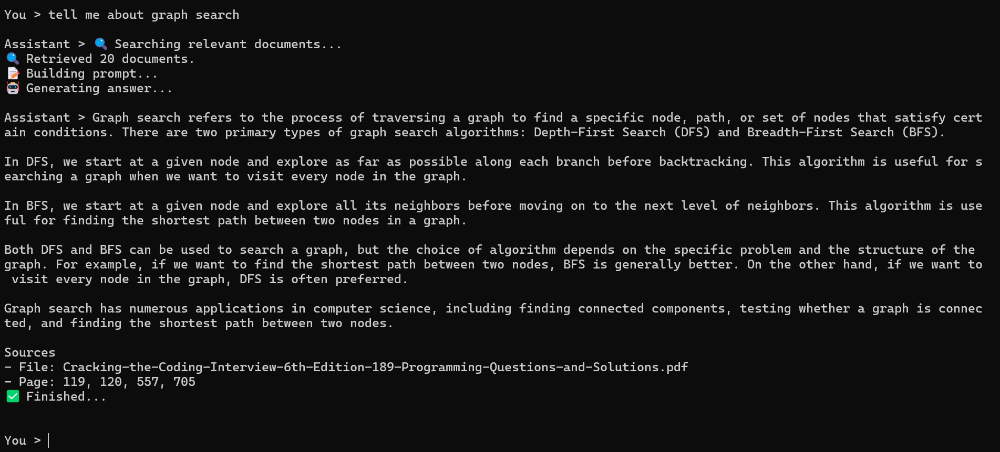
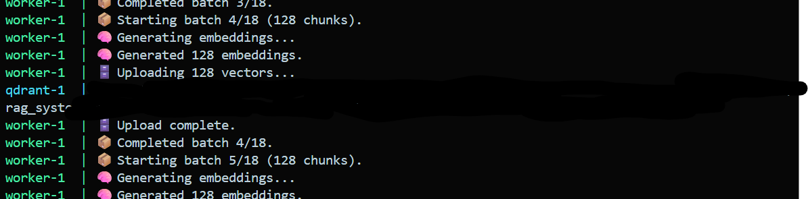
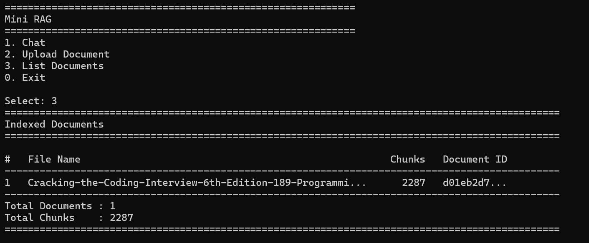
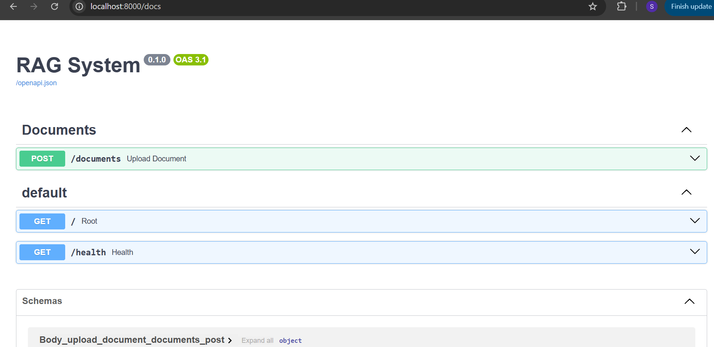
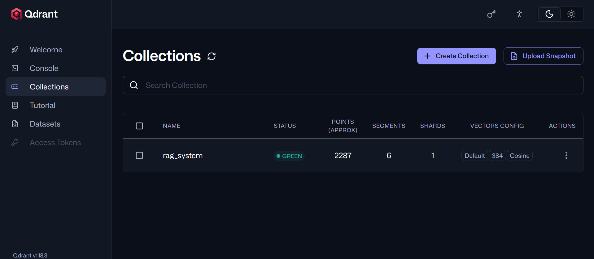
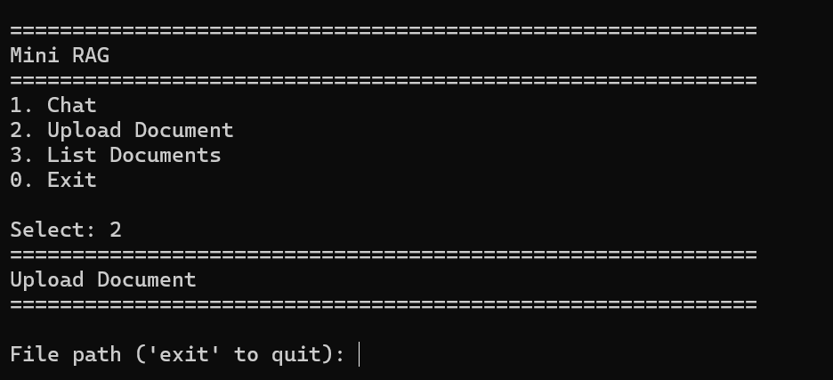

# Mini RAG


<p align="center">
A production-style Retrieval-Augmented Generation (RAG) system built from scratch using FastAPI, Qdrant, HuggingFace Embeddings, Groq, RQ, and Docker.
</p>

<p align="center">


</p>

---

# ✨ Overview

Mini RAG is a modular Retrieval-Augmented Generation (RAG) system built from first principles.

Instead of relying entirely on high-level LangChain abstractions, the project implements each stage of the RAG pipeline as an independent service—from document ingestion and chunking to embeddings, retrieval, prompt construction, conversation memory, and streaming responses.

The goal is to demonstrate how production-style RAG systems are designed while keeping every component replaceable and easy to extend.

---

## 🤔 Why this project?

I originally started this project while building another terminal-based AI assistant. To implement its knowledge retrieval capabilities, I needed a deeper understanding of Retrieval-Augmented Generation (RAG).

What began as a small learning project quickly evolved into a modular RAG system implementing document indexing, vector search, prompt engineering, conversation memory, and streaming responses. Today, Mini RAG serves as both a production-style foundation for future AI applications and a practical exploration of building modern RAG systems from first principles.

---

## 🚀 Features

- 📄 Asynchronous document indexing with FastAPI + RQ Workers
- ✂️ Configurable document chunking
- 📦 Batch embedding generation and vector uploads
- 🧠 Pluggable HuggingFace embedding providers
- 🗄️ Dual indexing:
  - LangChain automatic storage
  - Manual Qdrant point construction
- 🔍 Dual retrieval:
  - Native Qdrant search
  - LangChain retrieval
- 🎯 Score-threshold filtering
- 💬 Conversation-aware RAG with session memory
- ⚡ Streaming responses from Groq
- 📚 Automatic source citations
- 🧩 Modular factory-based architecture
- 📡 Event-driven progress reporting
- 🐳 Fully Dockerized

---

# 🏗 Architecture

```text
                User
                  │
       ┌──────────┴──────────┐
       ▼                     ▼
    FastAPI                 CLI
       │                     │
       ▼                     ▼
  Background Queue      Chat Service
       │                     │
       ▼                     ▼
    RQ Worker          Conversation
       │                     │
       ▼                     ▼
 Document Pipeline ─────► RAG Service
                             │
                             ▼
                        Retriever
                             │
                             ▼
                      Prompt Builder
                             │
                             ▼
                          Groq LLM
                             │
                             ▼
                      Streaming Answer
```

---
## Screenshots

### 💬 Interactive CLI

<p align="center">
  
</p>

Ask questions about your indexed documents through a streaming, conversation-aware CLI interface.

### 📤 Document Upload & Background Indexing

<p align="center">
  
</p>

Documents are uploaded through FastAPI and processed asynchronously by RQ workers. During indexing, the system performs chunking, batch embedding generation, and batched vector uploads while reporting real-time progress events.

### 📚 Indexed Documents

<p align="center">
  
</p>

View all indexed documents along with their document IDs and total chunk counts.

### 🌐 REST API

<p align="center">
  
</p>

FastAPI automatically exposes interactive API documentation for uploading and managing documents.

### 🗄️ Qdrant Dashboard

<p align="center">
  
</p>

Inspect vector collections, payload metadata, and indexed documents directly through the Qdrant dashboard.

### 🚀 CLI

<p align="center">
  
</p>

A simple command-line interface for uploading documents, browsing indexed files, and chatting with your knowledge base.

---

# 🛠 Technology Stack

| Layer | Technology |
|--------|------------|
| Language | Python 3.12 |
| API | FastAPI |
| Queue | RQ |
| Broker | Valkey |
| Vector Database | Qdrant |
| Embeddings | HuggingFace |
| LLM | Groq |
| Chunking | LangChain |
| Containers | Docker |


---


# ⚙️ Installation

## 1. Clone the repository

```bash
git clone https://github.com/sayan-dey12/rag-system
cd mini-rag
```

## 2. Configure environment variables

Create a `.env` file.

```env
GROQ_API_KEY=...
GROQ_MODEL=...
EMBEDDING_MODEL=...
QDRANT_COLLECTION=rag_system
```

## 3. Start the infrastructure

The project uses Docker Compose to run all required services:

- FastAPI
- RQ Worker
- Qdrant
- Valkey

Start them with:

```bash
docker compose up -d
```

Verify that everything is running:

```bash
docker compose ps
```

---

## 4. Launch the application

### Option A

If you have **Python** and **uv** installed inside your WSL environment, simply run:

```bash
uv run python run.py
```

### Option B

If you don't have Python or uv configured in WSL, start the Docker services first:

```bash
docker compose up -d
```

Then launch the CLI inside the API container:

```bash
docker compose exec api uv run python -m app.cli.main
```

- Upload documents using

```
http://localhost:8000/docs
```

---

After launching the application, you will see:

```text
1. Chat
2. Upload Document
3. List Documents
0. Exit
```

The built-in CLI supports:

- Chat with indexed documents
- List indexed documents
- Launch document upload flow

Responses stream token-by-token and maintain session memory during the conversation.

---

# 🌐 REST API

Swagger UI:

```
http://localhost:8000/docs
```

Available endpoints include:

- Upload documents
- Health check

Document indexing runs asynchronously using RQ workers.

---

# 🚀 Roadmap

- Hybrid Search
- Cross-Encoder Re-ranking
- Metadata Filtering
- Local LLM Support
- Multiple Chat Sessions
- REST Chat API
- React Dashboard
- OCR
- Tool Calling

---

# 🤝 Contributing

Contributions are welcome!

1. Fork the repository
2. Create a feature branch
3. Commit your changes
4. Open a Pull Request


---

# 👨‍💻 Author

**Sayan Dey**

Backend Developer • AI Engineer • DevOps Enthusiast

Passionate about building scalable AI systems, developer tools, and production-grade backend architectures.

- Portfolio: https://sayanbuilds.online
- GitHub: https://github.com/sayan-dey12
- LinkedIn: https://linkedin.com/in/sayan-dey-b37843378